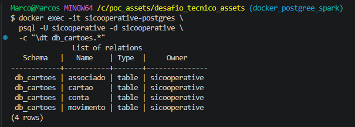
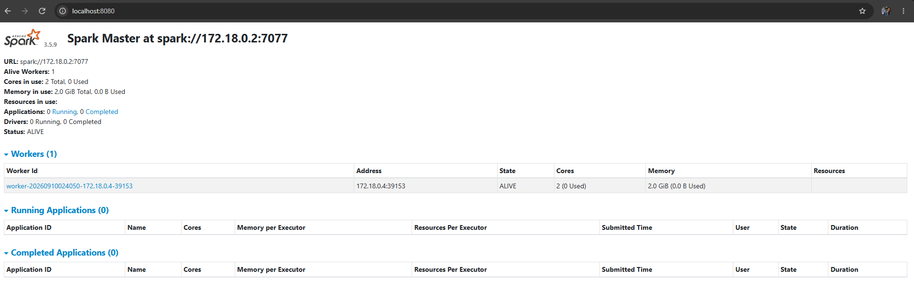
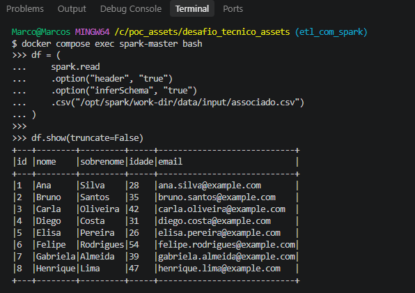
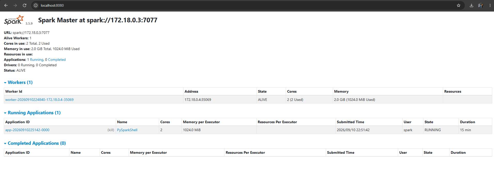
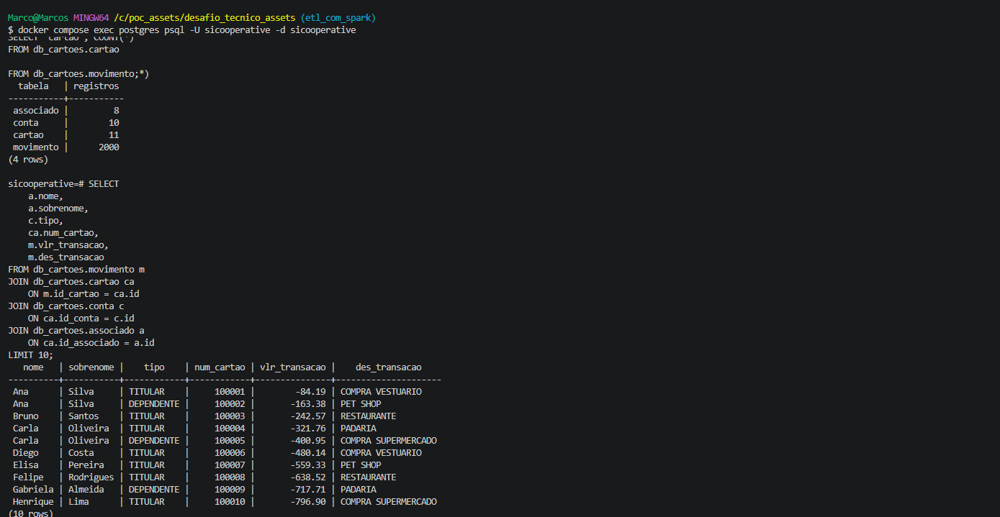
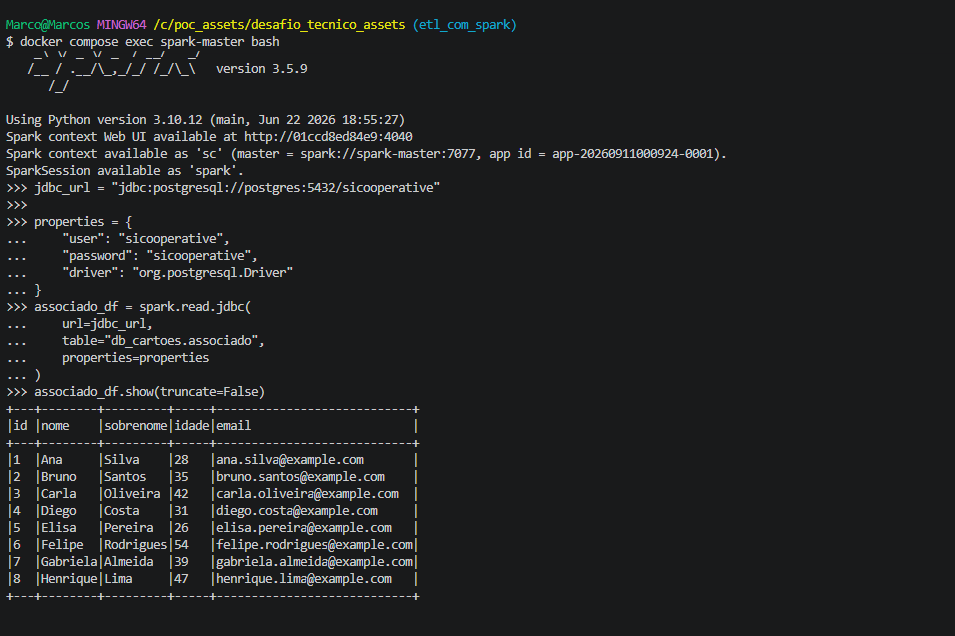

## 🎯 Cenário Identificado

**Problema:** Relatórios demorados e com baixa confiabilidade de dados, impactando a velocidade e a assertividade na tomada de decisão por parte de gestores e diretores.

**Causa:** Dificuldade em agregar diferentes fontes de informação em um único ponto, exigindo tempo excessivo na criação de relatórios individuais e em análises comparativas.

**Solução proposta:** Fazer uma POC para construção de um Data Lake.

## Etapas a serem concluídas

Para melhor organizar o desafio, o problema foi dividido em quatro etapas:

1. Levantar os pré requisitos do projeto
2. Criação das tabelas em banco relacional
3. Ingestão de dados fictícios
4. ETL para criação da tabela Flat
5. Exportação parametrizável de arquivo CSV em diretório local


## Proposta de Solução | Stack

Para este desafio, optei por Python e SQL como linguagens principais, por serem as mais amplamente utilizadas em times de dados, em comparação a alternativas como Scala ou Java.

Visando portabilidade e agilidade no desenvolvimento, utilizei **Docker** para provisionar o banco de dados **PostgreSQL** e o framework de processamento **Spark**. A escolha do Spark levou em conta sua ampla utilização no ambiente do Sicredi.

Cada ferramenta da stack foi definida com uma responsabilidade específica, conforme resumido abaixo:

| Tecnologia | Responsabilidade |
| --- | --- |
| 🐍 **Python** | Linguagem principal |
| ⚡ **PySpark** | Processamento e transformação dos dados |
| 🧪 **Pytest** | Testes automatizados |
| 🐳 **Docker** | Containerização e isolamento do ambiente |
| 🐘 **PostgreSQL** | Banco de dados de origem |
| ⚡ **Apache Spark** | Runtime de processamento |

O objetivo foi construir uma arquitetura **reprodutível, simples, testável, organizada e preparada para escalabilidade**.

Por se tratar de uma POC, irei abstrair a criação de gerenciadores de dependencias e versões de python, como o (**Pyenv**) para controle de versão e (**Poetry**) para gerenciamento de dependências.

---


## 🏗️ Desenho de Pipeline 

```text
                         ETL PIPELINE

┌──────────────────┐
│    PostgreSQL    │
│  Source Database │
└────────┬─────────┘
         │
         │ Extract
         ▼
┌──────────────────┐
│     PySpark      │
│                  │
│   Transform      │
│   Validate       │
│   Load           │
└────────┬─────────┘
         │
         │ Load
         ▼
┌──────────────────┐
│      Target      │
│     Storage      │
└──────────────────┘

```

## Decisões de Arquitetura

1. Banco de Dados Postgres e Spark serão provisioandos usando Docker, em imagens separadas. Para comunicação entre os dois usei uma conexão JDBC, dessa forma conseguimos separar o que é armazenamento e o que é processamento.

```text
┌──────────────────── Docker Environment ───────────────────┐
│                                                           │
│   ┌──────────────────┐          JDBC       ┌───────────┐  │
│   │   PostgreSQL     │◄───────────────────►│   Spark   │  │
│   │                  │                     │           │  |
│   │  Source Database │                     │ PySpark   │  │
│   └──────────────────┘                     └───────────┘  │
│                                                           │
└───────────────────────────────────────────────────────────┘
                                                   │
                                                   ▼
                                             CSV / output
```

2. Usaramoes o Spark de forma local dentro do container, através do PySpark. Por se tratar de uma POC, não precisamos nos preocupar no momento com o gerenciamento e configuração de clusters.

3. Para ingerir os dados nas nossas tabelas no banco postgres usaremos o biblioteca psycopg para fazer um COPY INTO, usaremos o Spark via JDBC para exportar a tabela flat no formato CSV. Os dados ficticios serão gerados através de IA e disponibilizados no repositorio para melhor replicação.

4. Por se tratar de uma POC, colocaremos infomrações de infraestrutura diretamente no docker compose, sem precisar de um arquivo .env 

5. Para a saída parametrizavel do arquivo CSV, utilizaremos o proprio CLI para o output dos dados. 

## Organização do Diretório

```text
desafio_tecnico_assets/
│
├── data/
│   └── input/
│       ├── associado.csv
│       ├── conta.csv
│       ├── cartao.csv
│       └── movimento.csv
│
├── docker/
│   └── spark/
│       └── Dockerfile
│
├── sql/
│   └── ddl/
│       └── create_tables.sql
│
├── src/
│   ├── seed/
│   │   └── seed_data.py
│   │
│   ├── etl/
│   │   └── movimento_flat.py
│   │
│   └── main.py
│
├── tests/
│   └── test_movimento_flat.py
│
├── output/
│
├── docker-compose.yml
├── requirements.txt
├── .gitignore
└── README.md
```

## Anotações durante o desenvolvimento 

1. Durante a montagem do Dockerfile e docker-compose.yml precisei revisitar alguns estudos sobre docker, para melhor configurar o container, tanto para o Spark conversar com o Postgres quanto para exportar o arquivo final.

2. Criei um schema chamad db_cartoes para criarmos as nossas tabelas com o script create_tables.sql
2.1 Tive que ajustar algumas configurações no docker-compose.yml, pois os drivers do worker não estavam seguindo o mesmo padrão que o do master. \
2.2 Com o comando 'docker compose up --build' conseguimos subir o postgres corretamente e aplicar o scrip DDL, com o comando \dt db_cartoes.* conseguimos ver a criação das 4 tabelas, conforme print a baixo: \
 \
2.3 Também verifiquei se o Spark subiu corretamente e se o Worker e o Master estão conectados corretamente, O worker esta como Alive, comprovando que tudo ocorreu corretamente: 


3. Na hora de testar o Spark acabei não adicionando o path do caminho com os arquivos em CSV, precisei configurar o yml do Docker e adicionar os caminho na seção volumes, tanto do master quanto do worker do spark. Após testar novamente conseguimos testar o spark e verificar se aplicação estava ON no localhost: \



4. Para ingerir os arquivos CSV no postgres foi uma etapa tranquila, utilizamos o copy into nativo do banco para subir os arquivos. A montagem do arquivo seed_data.py foi um pouco complexo para adicionar os comandos do CLI, mas utilizei uma lib nativa chamada argparse. \
4.1 Na criação do seed_data.py montei uma logica para que caso alguma ingestão falhe, todas falhem, para evitar erros. Além disso ele segue o padrão do DLL e suas FKs: associado → conta → cartao → movimento, caso nn siga essa ordem o banco retornaria erro pois não terias as cheves necessarias. \
4.2 Apos executar o comando python src/seed/seed_data.py --reset podemos ver os dados ja dentro da tabela, também fizemos uma consulta para verificar se as chaves estavam sendo respeitadas: \


5. Para construirmos a pipeline da criação da tabela movimento_flat, primeiro testei a conexão do Spark com o Postgres, através do comando spark.read.jdbc(), que deu certo para a tabela associado: 
 \
5.1 Durante a montagem da query da tabela movimento_flat, percebi que uma das colunas "data_criacao_cartao" não esta em nenhuma das tabelas inicias. Para não ter que criar um campo nulo e "martelar" essa coluna, optei por não traze-la. Também não utilizei a data de criação de conta como a data de criação do cartão, pois podemos ter associados que não possuem cartão de crédito.
5.2 Para que o destino do CSV ser parametrizavel, nós precisamos alterar o volumes do conteiner, pois o spark só terá acesso aos direotorios que disponibilizarmos para ele. Nesta POC eu disponibilizei a pasta output para que possamos salvr o arquivo, com o comando --output-dir  nós podemos salvar em qualquer pasta criada dentro desse caminho, como por exemplo: /opt/spark/work-dir/output/teste_novo_caminho, basta descrever esse caminho na hora de executar o codigo main.py dentro do Spark.


